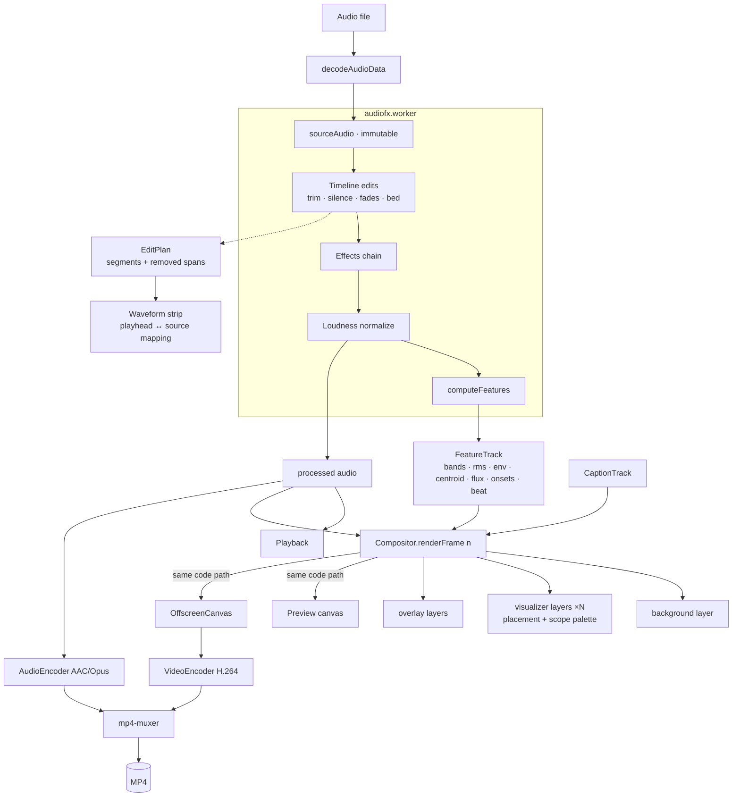

# Architecture

How Vox Orbita is put together, and *why*. For the short version aimed at
contributors and AI assistants, see [CLAUDE.md](CLAUDE.md).

## Layering

```
src/
  engine/          framework-agnostic core — no DOM beyond canvas contexts
    types.ts         FeatureTrack, ThemeColors/Scopes, feature sampling
    features.ts      FFT analysis → FeatureTrack
    fft.ts, prng.ts, mat4.ts     pure math primitives
    audio.ts         decode / channel helpers
    audio-edit.ts    timeline edits + ITU-R BS.1770 loudness
    audio-fx.ts      effects chain (pure DSP)
    captions.ts      caption model + grouping + WebVTT
    compositor.ts    renders one frame of the layer stack
    gl.ts            minimal WebGL2 helper (programs, uniforms, blit)
    layers/          every visual preset (background / visualizer / overlay)
    export/          capability probe, MP4 (WebCodecs), WebM fallback
    project.ts       project state, (de)serialization, migrations
    registry.ts      the single place presets are plugged in
  ui/              vanilla DOM studio
    app.ts           orchestrator: state, playback, panel, export
    controls.ts      schema → DOM controls (auto-generated panel)
    waveformstrip.ts source waveform + trim/cut overlay + playhead
    *.worker.ts      audio pipeline, transcription
  themes.ts, i18n.ts
```

The dependency rule: **`ui/` may import `engine/`, never the reverse.** The
engine is deliberately runnable in a worker and in Node (that's what makes the
DSP and analysis unit-testable without a browser).

## Data flow



## Why the analysis is pre-computed

Everything the renderer needs is computed **once** into a `FeatureTrack`
indexed by frame: 64 log-spaced bands, RMS, peak envelope, spectral centroid,
spectral flux, onsets, and a decaying beat envelope. Preview and export both
read that matrix instead of analysing live.

This is what makes preview ≡ export possible, and it's why seeking is exact:
there is no analyser state to be "warmed up".

Sampling helpers in `types.ts` accept **fractional** frames and interpolate, so
a 30 fps project still animates smoothly on a 120 Hz display, while export
requests integer frames and hits a bit-exact fast path.

## The layer plugin system

A frame is `background → visualizer(s) → overlays`. Each layer is a
`LayerDef { id, kind, schema, create() }`. The `schema` is the single source of
truth: it defines defaults, drives the auto-generated controls panel, and
governs project (de)serialization and clamping. Adding a preset therefore
requires **no UI code** — only the layer file, a registry entry, and i18n
labels.

Visualizers are instanceable (up to `MAX_VISUALIZERS`), each with a
`Placement { x, y, scale }` applied by the compositor as a translate+scale
around the layer's centre. Layers keep drawing as if they own the whole frame.

## Audio pipeline

Two deliberately separate concerns:

- **`audio-edit.ts` — structure.** Trim, silence detection/removal, fades,
  looped music bed with sidechain ducking, and loudness. It also produces an
  `EditPlan` (retained segments + removed spans) so the UI can map the playhead
  between *output* time and *source* time across cuts — that's what lets the
  waveform strip show the original file with cuts marked while playback runs on
  the edited result.
- **`audio-fx.ts` — tone.** An ordered chain of independently-toggleable
  stages (filter, gate, EQ, compressor, pitch shift, ring mod, distortion,
  bitcrush, echo, reverb, output), each a pure function.

Loudness normalization is applied **after** the effects chain, because effects
change level and the delivered file has to hit its LUFS target. The
implementation follows ITU-R BS.1770-4: K-weighting (high-shelf + RLB
high-pass, recomputed for the actual sample rate), 400 ms blocks at 75 %
overlap, −70 LUFS absolute gate and −10 LU relative gate. A unit test checks a
−23 dBFS 1 kHz stereo tone reads ≈ −23 LUFS.

## Captions

`transcribe.worker.ts` dynamically imports transformers.js and runs Whisper
locally; the model weights come from the Hugging Face CDN once and are cached
by the browser, but **the audio never leaves the machine**. Output is a
`CaptionTrack` of timestamped words grouped into display lines. The
`ov-captions` overlay renders the line active at `rc.time` with optional
word-level karaoke highlighting — pure data + time, so it stays deterministic.

transformers.js is code-split into its own lazy chunk; the base studio bundle
stays small and only pays for it when the user actually transcribes.

## Export

`export/capabilities.ts` probes, in order: H.264 + AAC → H.264 + Opus (MP4), and
falls back to MediaRecorder WebM with a visible notice. Frame timestamps derive
from the frame index only (`round(n · 1e6 / fps)`), and audio is fed
sample-accurately from the decoded PCM, so A/V sync is exact at start, middle
and end. Encoding is back-pressured on `encodeQueueSize` and yields
cooperatively so the progress UI stays responsive; typical throughput is
several times realtime at 1080p.

120 fps is offered but capped to 1080p (`maxHeightForFps`) because H.264
encoder levels don't allow 4K at that rate.

## Testing

- **Vitest** (`tests/`) covers the engine: FFT, band mapping, feature
  determinism, onset detection, fractional sampling, DSP effects, timeline
  edits, loudness, captions, project round-trip + migrations.
- **Playwright** (`e2e/`) covers the real browser: valid MP4 export,
  preview≡export pixel identity (plain and with placed multi-visualizer
  stacks), effects baked into exported audio, timeline edits changing duration,
  120 fps export, per-scope palettes, and an axe accessibility scan.
