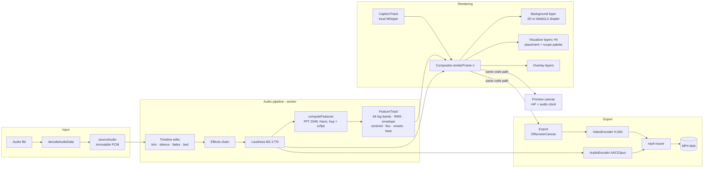

# Vox Orbita

**Voice notes in, videos out.** Vox Orbita is a client-side web studio that
turns voice notes and podcasts (MP3 / OGG / WAV) into shareable MP4 videos
with audio-reactive visuals. No backend, no uploads, no accounts — your audio
never leaves your machine.

- **Twelve visualizer presets** — radial spectrum, linear spectrum, waveform
  ribbon, WebGL2 particle field, a rotating oscilloscope (Lissajous figures
  with beat-driven spin, phase skew and a smeared trail), circular waveform,
  a Matrix-style **code rain** wall (rain always falls; each column is a
  spectrum band that lights up bottom-up like a glyph equalizer), a
  **spectrum tunnel** and a **waterfall ridgeline** (both built from spectrum
  *history*, so you fly through the sound), a symmetric **kaleidoscope**
  mandala, and two rotating **3D presets**: a spectrum wheel (lit, extruded
  bar ring) and a pulse sphere (band-displaced wireframe planet), both driven
  by a raw WebGL2 perspective pipeline (`src/engine/mat4.ts` — no three.js)
- **Stack up to four visualizers** and place each one anywhere on the canvas
  (position + scale per instance) to build split-screen and picture-in-picture
  compositions — placement survives the export path exactly
- **Twelve audio-reactive backgrounds** — gradient flow, fbm noise field,
  aurora, water ripples that propagate from each onset, a synthwave neon grid,
  nature-geometry patterns (hex lattice, topographic contour lines, voronoi
  cells), plus **three true-3D sci-fi scenes** rendered with real perspective,
  normals and distance fog: a **hyperspace corridor** (analytic ray↔cylinder,
  panelled walls, light bands racing past), a **Menger-sponge megastructure**
  (raymarched alien architecture that reconfigures with the music) and an
  infinite **crystal lattice** you fly through — plus solid color, your own
  image, and an animated **pixel-art sprite loop** (see
  [docs/pixel-art-prompts.md](docs/pixel-art-prompts.md))
- **Fluid preview** — feature sampling supports fractional frames, so a
  30 fps project animates at full display refresh in the studio while export
  still renders exact integer frames
- **Audio effects chain** — pure-DSP, non-destructive stages (filter, noise
  gate, 3-band EQ, compressor, granular pitch shift, ring modulator,
  distortion, bitcrusher, echo, Schroeder reverb, output/normalize) with
  one-click presets for **podcasting** (clean / warm), **voice anonymization**
  (pitch-shifted deep / high), and creative use (robot, telephone). Effects
  change the actual audio: visuals react to the processed sound and it is
  baked into the exported video. All effects are deterministic and run in a
  worker so long podcasts don't freeze the UI
- **Timeline audio editing** — trim with in/out points on the waveform,
  **automatic silence removal** (the strip marks exactly what gets cut),
  fades, a looped **music bed** with sidechain ducking under the voice, and
  **ITU-R BS.1770 loudness normalization** to platform targets (−16 LUFS
  podcast, −14 YouTube, −23 broadcast)
- **Captions** — Whisper runs locally in a worker (model weights come from a
  CDN once; your audio never leaves the browser) producing word-timed captions
  with karaoke highlighting, burned into the video or exported as `.vtt`
- **Overlays** — captions, title/subtitle, episode progress bar, beat-reactive logo
- **Fast MP4 export** — WebCodecs H.264/AAC via
  [`mp4-muxer`](https://github.com/Vanilagy/mp4-muxer); typically several times
  faster than realtime at 1080p30. Browsers without WebCodecs fall back to
  a WebM MediaRecorder export with a clear notice
- **10 curated palettes** (including a neon family: Cyber, Laser, Acid,
  Synthwave), applied **per component** — the app chrome, background,
  visualizers and overlays each get their own palette
- 16:9 / 1:1 / 9:16, up to 4K, **30 / 60 / 120 fps** (120 fps caps at 1080p)
- **English + Brazilian Portuguese**, auto-detected, switchable
- Project save/load as JSON, full keyboard operation

## Running

```bash
npm install
npm run dev        # local studio at http://localhost:5173
npm run build      # static bundle in dist/ (deploy to GitHub Pages, Vercel, …)
npm test           # engine unit tests (Vitest)
npm run e2e        # Playwright smoke test (builds + exports a real MP4)
```

The build is fully static and uses relative paths (`base: './'`), so it can be
served from any subdirectory.

## Architecture

Everything under `src/engine` is framework-agnostic TypeScript with no DOM
dependencies beyond the canvas contexts passed into it. The UI (`src/ui`) is
vanilla TypeScript over small DOM helpers.

Deeper write-up: **[ARCHITECTURE.md](ARCHITECTURE.md)**. Working notes and
gotchas for contributors and AI assistants: **[CLAUDE.md](CLAUDE.md)**.



### Determinism: preview ≡ export

The single most important design rule: **frame N is a pure function of
(N, project config, FeatureTrack, AudioSource, theme)**.

- All audio features are **pre-computed** per frame at the project frame rate.
  Preview and export read exclusively from this matrix — nothing is analyzed
  "live".
- Layers may not keep simulation state. Anything that looks random (particle
  jitter, drift) comes from seeded hashes of frame/particle indices
  (`src/engine/prng.ts`), and particle motion is integrated in closed form, so
  seeking to a frame renders exactly what playing to it would. The 3D presets
  follow the same rule: rotation is a function of `frame / fps`, and geometry
  is rebuilt each frame from the FeatureTrack.
- Export timestamps derive from the frame index only
  (`timestamp = round(n · 10⁶ / fps)`), and audio is fed sample-accurately
  from the decoded PCM, so A/V sync is exact at the start, middle and end.

The Playwright smoke test asserts this literally: the preview compositor and a
fresh export-sized compositor must produce byte-identical PNGs for the same
frame.

### Layer system

A frame = background → visualizer → overlays. Each layer is a plugin
(`LayerDef`) with a typed config schema; the right-hand controls panel is
**generated entirely from the schema** — see
[CONTRIBUTING.md](CONTRIBUTING.md) for the 30-line guide to adding a preset
with zero UI code.

### Export pipeline

`src/engine/export/capabilities.ts` probes, in order: H.264+AAC (MP4),
H.264+Opus (MP4, for Chromium builds without AAC licensing), then
MediaRecorder WebM as a realtime fallback. Encoding runs on WebCodecs'
internal threads; the frame loop renders into an `OffscreenCanvas`, applies
encoder back-pressure (`encodeQueueSize`), and yields cooperatively so the
progress UI stays live. There is no ffmpeg.wasm and no server.

## Browser support

| Capability | Chrome / Edge 102+ | Firefox 130+ | Safari 16.4+ |
| --- | --- | --- | --- |
| Studio + preview | ✅ | ✅ | ✅ |
| MP4 export (WebCodecs) | ✅ | ⚠️ partial → falls back | ❌ → WebM fallback |
| WebM fallback | ✅ | ✅ | ❌ (no VP9 MediaRecorder) |

Feature detection is dynamic — whatever the browser actually supports is what
the export dialog offers, with a plain-language notice when falling back.

## Privacy

Vox Orbita is 100% client-side. Audio, images, and projects are processed in
memory in your browser tab. Nothing is uploaded anywhere; there is no
telemetry.

## License

[MIT](LICENSE)
